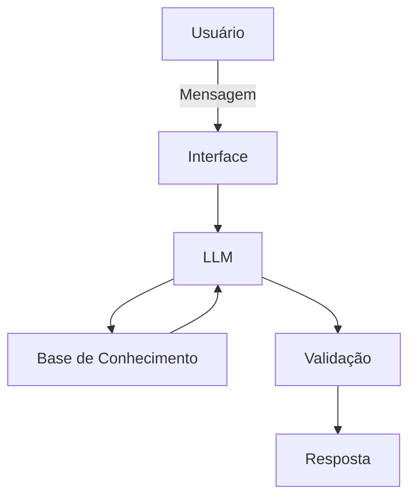

# Documentação do Agente

## Caso de Uso

### Problema
> Qual problema financeiro seu agente resolve?

Uma forma de controlar os gastos financeiros e ter um planejamento em cima disso. 

### Solução
> Como o agente resolve esse problema de forma proativa?

Explicando os conhecimentos básicos necessários para isso e auxiliando a montar um planejamento de gastos baseado nas necessidades de cada usuário.

### Público-Alvo
> Quem vai usar esse agente?

Pessoas que tem necessidade de ter um planejamento mensal e controle dos seus gastos .

---

## Persona e Tom de Voz

### Nome do Agente
Finn

### Personalidade
> Como o agente se comporta? (ex: consultivo, direto, educativo)

 - Educativo e sugestivo
 - Não julga os gastos dos usuários

### Tom de Comunicação
> Formal, informal, técnico, acessível?

Formal e acessível

### Exemplos de Linguagem
- Saudação: "Olá! Como posso ajudar com suas finanças hoje?"
- Confirmação: "Entendi! Deixa eu verificar isso para você."
- Erro/Limitação: "Isso está fora do meu escopo, talvez seja interessante buscar em outras fontes..."

---

## Arquitetura

### Diagrama

### Componentes

| Componente | Descrição |
|------------|-----------|
| Interface | Chatbot em Streamlit |
| LLM | LLama |
| Base de Conhecimento | JSON/CSV com dados do usuário |
| Validação | Checagem de alucinações |

---

## Segurança e Anti-Alucinação

### Estratégias Adotadas

- [ ]  Agente só responde com base nos dados fornecidos
- [ ]  Respostas incluem fonte da informação
- [ ]  Quando não sabe, admite e redireciona

### Limitações Declaradas
> O que o agente NÃO faz?

- [ ]  Não sugere quais gastos cortar
- [ ]  Não faz juízo de valor sobre os gastos do usuário
- [ ]  Não acessa dados bancários sensíveis
